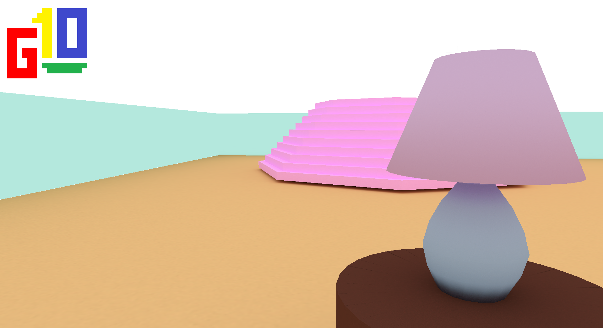

# G10 Game Engine Documentation
###### NOTE: This is a hobby project to explore game engine development. As such, this repository may be updated at random intervals. This code may not be the most efficient or safe, and may not meet commercial standards for software testing 

## Overview
1. Definitions
    - G10 structures
        - Scene
            - Entity
                - Part
                - Shader
                    - Uniform
                    - KeyValue
                - Material
                    - Texture
                - Transform
                - Rigidbody
                - Collider
                    - BV
            - Camera
            - Light
            - BVH


## G10 definitions
### Structures
#### ≡ Scene ≡ 
A scene is a container for entities, cameras, and lights. 
```c
struct GXScene_s {
    char        *name;
    GXEntity_t  *entities;
    GXCamera_t  *cameras;
    GXLight_t   *lights;
    GXBV_t      *BVH;
    GXSkybox_t  *skybox;
};
```

#### ≡ Entity ≡ 
An entity is a container for anything that will be drawn or will be physically active
```c
struct GXEntity_s
{
    char              *name;      // A name for the entitiy
    GXPart_t          *parts;     // A list of parts
    GXShader_t        *shader;    // A shader
    GXMaterial_t      *materials; // A list of materials
    GXTransform_t     *transform; // A transform
    GXRigidbody_t     *rigidbody; // A rigidbody
    GXCollider_t      *collider;  // A collider

    struct GXEntity_s *next;      // Points to the next entity.
};
```

## Demo application
Below is source code of a simple game. 
```c
#include <stdbool.h>
#include <G10/G10.h>

int main(int argc, const char[] argv)
{
	// Declare your variables, initialize your data, call g_init, etc 
	...

	// Initialized data 

	GXScene_t *scene   = load_scene("level 1/level 1.json");

	// Game loop 
	while(instance->running)
	{
		g_delta();
		
		process_input(instance);
		
		g_clear();

		draw_scene(scene);

		g_swap();
	}

	/* Clean up G10 */
	destroy_scene(scene);
	
	g_exit();
	
	return 0;
}
```
